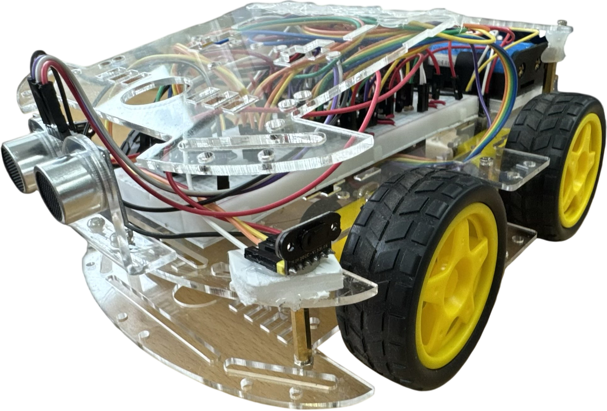

<div align="center">

# 🏎️ PR_CAR

### FreeRTOS 자율주행 RC카 · ToF 복도 센터링 · IMU 코스축 유지 · 실시간 텔레메트리

<p>
  
  
  
  
  
</p>

<!-- TODO: assets/ 폴더에 아래 이미지를 추가한 뒤 주석을 해제하세요. -->
<p>
  
  &nbsp;&nbsp;
  <!--  -->
</p>

**전방 초음파 · 측면 ToF ×2 · 9축 IMU · 휠 엔코더 ×2를 융합해 복도형 트랙을 자율주행하는 STM32 + FreeRTOS 임베디드 프로젝트입니다.**

### :movie_camera: 시연 영상


https://github.com/user-attachments/assets/8a7412c8-d69e-47a4-b9cc-b2d05f96503b
</div>

---

## 1. Project Overview

"장애물이 보이면 멈추고 돈다"는 반응형 회피를 넘어, **복도의 중앙을 유지하며 코스 축을 따라 달리는** 주행을 목표로 설계했습니다.

측면 거리는 크로스토크에 취약한 초음파 대신 VL53L0X ToF 2개를 차체에 수직 장착해 실제 측면 여유(lateral clearance)를 직접 읽고, PD 센터링으로 좌우 균형을 맞춥니다. 방향은 BNO055 IMU의 상대 heading을 **부팅 기준 90° 배수 코스 축**에 스냅해 유지하므로, 코너를 돌 때마다 축이 갱신되어 누적 드리프트 없이 직진성을 확보합니다. 속도는 "센싱·제동 예산을 넘지 않는다"는 원칙 아래, 전방 거리·측면 거리·헤딩 오차·요레이트 각각의 상한 중 **가장 낮은 값이 이기는** 거버너로 결정합니다.

시스템 구조는 FreeRTOS 3태스크(Sensor / Motor / Bluetooth)이며, **모터 명령 발행자는 MotorTask 하나**, **뮤텍스 0개**(값복사 큐 + 단일작성자 volatile), **IWDG refresh는 신선한 센서 프레임을 수신했을 때만** 이라는 세 가지 불변식 위에 세워져 있습니다. 이 불변식 덕분에 센서 태스크 사망·큐 단절·모터 태스크 행(hang) 어느 쪽이든 2.048초 안에 워치독 리셋으로 수렴합니다.

| 항목 | 내용 |
|---|---|
| 프로젝트 형태 | 개인 임베디드 시스템 프로젝트 |
| 담당 범위 | 기획, 회로 구성, STM32 펌웨어, 주행 알고리즘, 튜닝, 텔레메트리, 문서화 |
| MCU | STM32F411CEU6 (UFQFPN48, 100 MHz) |
| RTOS | FreeRTOS / CMSIS-RTOS2 (tick 1 kHz, heap_4 15,360 B) |
| Language | C |
| Development | STM32CubeMX, CMake / Makefile (arm-none-eabi-gcc), SWD |
| 주요 인터페이스 | TIM Input Capture, TIM PWM, I²C, UART, EXTI, IWDG |
| 센서 | HC-SR04 (전방), VL53L0X ×2 (측면), BNO055 (IMU), SG-207 포토인터럽터 ×2 (엔코더) |
| 구동 | L298N 차동 구동 (4륜 스키드 스티어링) |

---

## 2. Key Features

| 기능 | 구현 내용 |
|---|---|
| **3-Task RTOS** | `SensorTask` → 값복사 큐 → `MotorTask`, 통신 전담 `BluetoothTask` 분리 |
| **Zero-Mutex Design** | 다필드 스냅샷은 큐, 원자폭 이하 상태는 단일작성자 `volatile`로 해결 |
| **Data-gated IWDG** | 큐 수신 성공 시에만 refresh — 파이프라인 침묵 = 2.048 s 후 리셋 |
| **7-State Drive FSM** | `CRUISE`/`BRAKE`/`SPIN`/`REVERSE`/`HOLD`/`SIDE_AVOID`/`CORNER` |
| **ToF Pair Centering** | 수직 장착 VL53L0X 좌우 거리 오차 기반 PD 센터링 + 벽 반발항 |
| **Course-Axis Heading Hold** | 부팅 기준 90° 배수 축에 스냅 — 절대방위 미신뢰, 누적 드리프트 제거 |
| **Speed Governor** | 전방·측면·헤딩·요레이트 4개 상한 중 최솟값 채택 (제동 예산 우선) |
| **Rolling Turn** | 안쪽 바퀴에 서브스톨 역토크(드래그 브레이크)를 걸어 **달리면서 도는** 코너링 |
| **Confirm-Gated Decision** | 전방 판정은 연속 fresh + 값 안정(±4 cm) 표본을 요구 — 단발 스파이크 차단 |
| **Pitch Gate** | 방지턱 통과 중(피치 \| 6° 초과) 전방·측면 에코를 무효화해 가짜 판정 차단 |
| **ToF Near-Trust Gate** | 고립·불안정 초근접값(< 60 mm)을 "타깃 없음"으로 공표 |
| **Encoder Speed Feedback** | TIM2 32-bit IC로 휠 주기 측정 → EMA 속도, 램 스톨 백스톱 입력 |
| **Live Telemetry** | 10 Hz CSV 프레임 IT 송신 + `#KEY=VAL` 런타임 파라미터 수신 |
| **Bus Recovery** | I²C wedge 시 9클럭 복구, UART ORE/NE/FE/PE 시 수신 재무장 |

---

## 3. System Architecture

<!-- TODO: assets/system_flow.png 추가 후 주석 해제
<p align="center">
  
</p>
-->

```text
┌──────────────────────── SensorTask (Low) ─────────────────────────┐
│  HC-SR04 전방  ─ TIM3_CH1 IC ─┐                                   │
│  VL53L0X L/R  ─ I2C1 연속측정 ─┼─► median(3) ─► 피치 게이트 ─┐     │
│  BNO055       ─ I2C1 polling ─┘   생존 게이트                │     │
└──────────────────────────────────────────────────────────────┼─────┘
                                                               │
                                    DriveInputs (값복사)       │
                                 osMessageQueue(depth 2) ◄─────┘
                                          │
┌───────────────────── MotorTask (Normal) ▼─────────────────────────┐
│  큐 수신 성공 → HAL_IWDG_Refresh()                                │
│  sys_power=0 → Car_Stop / sys_mode=1 → 수동 듀티                  │
│  else → Drive_Update()  ┌── CRUISE  : 센터링 + 축유지 + 거버너    │
│                         ├── TURN    : SPIN(피벗) / 롤링턴         │
│                         └── RECOVER : BRAKE / REVERSE /           │
│                                       SIDE_AVOID / HOLD           │
│  → Motor_SetWheels() → TIM4 CH1/CH2 PWM + L298N IN1~IN4           │
│  엔코더 속도 환산(Encoder_SpeedCmps) → 텔레메트리 미러            │
└───────────────────────────────────────────────────────────────────┘
┌──────────────────── BluetoothTask (Low) ──────────────────────────┐
│  RX: USART1 1-byte IT → uartQ → 레거시 1바이트 / '#KEY=VAL' 파서   │
│  TX: "T,t,f,L,R,h,vL,vR,st,fl,steer\n"  10 Hz, HAL_UART_Transmit_IT│
└───────────────────────────────────────────────────────────────────┘
```

### 3.1 Task Configuration

| Task | Priority | Stack | 역할 |
|---|---|---:|---|
| `MotorTask` | Normal | 256 word | 큐 수신, IWDG refresh, 주행 상태머신, 모터 명령 **단독 발행** |
| `SensorTask` | Low | 256 word | 초음파·ToF·IMU 측정, median 필터, 게이트 판정, 큐 송신 |
| `BluetoothTask` | Low | 384 word | 명령 파싱, 텔레메트리 프레임 조립 및 IT 송신 |

### 3.2 IPC

| Object | Type | 역할 |
|---|---|---|
| `driveQ` | Message Queue, depth 2 × `DriveInputs` | 센서 스냅샷 값복사 전달 (한 프레임 + 긴급 이벤트 1개) |
| `uartQ` | Message Queue, 16 × 1 byte | USART1 RX ISR → `BluetoothTask` |
| `sys_power` / `sys_mode` / `manual_*` | 단일작성자 `volatile` | BluetoothTask 작성, MotorTask 판독 |
| `tel_*` 미러 | 단일작성자 `volatile` | 표시 전용, 필드 간 ≤1 사이클 시차 허용 |

**뮤텍스는 하나도 사용하지 않습니다.** 여러 필드를 원자적으로 함께 봐야 하는 데이터는 큐로 값복사하고, 32-bit 이하 단일 값은 "작성자 태스크 1개" 규칙으로 보호합니다.

### 3.3 Fail-safe Chain

```c
if (osMessageQueueGet(driveQ, &din, NULL, DRIVE_Q_TIMEOUT_MS) == osOK)
{
    HAL_IWDG_Refresh(&hiwdg);   /* 센서 파이프라인 생존 = refresh */
    ...
}
else
{
    dbg.q_timeout++;
    Car_Stop();                 /* 센서 침묵 → 안전 정지, refresh 생략 */
}
```

| 계층 | 조건 | 동작 |
|---|---|---|
| 1차 | 큐 수신 150 ms timeout | `Car_Stop()` + refresh 생략 |
| 2차 | 무갱신 2.048 s (IWDG PSC 16, Reload 4095) | 하드웨어 리셋 |
| 3차 | 센서 전 채널 상실 | `DS_HOLD` 상태 진입 (정지 유지) |
| 4차 | I²C 버스 wedge | 연속 10회 실패 → SCL 9클럭 토글 복구 |
| 5차 | UART ORE/NE/FE/PE | 플래그 클리어 후 `Receive_IT` 재무장 |

부팅 시 BNO055 초기화(~800 ms)를 커널 기동 **전에** 수행하고, 직후 `HAL_IWDG_Refresh()`로 워치독 예산을 회복시켜 스케줄러 시작 전에 리셋되지 않도록 초기화 순서를 설계했습니다.

---

## 4. Sensor Pipeline

### 4.1 전방 초음파 (HC-SR04)

TIM3를 1 µs tick(`PSC = 100-1`)으로 두고 CH1 Input Capture로 Echo 폭을 측정합니다. 측정 완료는 폴링이 아니라 **osThreadFlags**로 SensorTask에 통지하여 대기 중 CPU를 점유하지 않습니다.

```c
/* ISR: Rising 캡처 → 폴라리티 Falling 전환 → Falling 캡처 → 거리 환산 */
echoTime = (uint16_t)(IC_Value2 - IC_Value1);   /* unsigned 뺄셈이 wrap 자동 처리 */
uint16_t measured_cm = echoTime / 58U;
if (measured_cm != 0U) { ... osThreadFlagsSet(s_waiter, ULTRA_FLAG_FRONT); }
```

- 측정 시작 전 Echo 핀이 아직 High면 **직전 측정이 끝나지 않은 것**으로 보고 즉시 실패 반환합니다.
- 한 사이클에 전방을 **두 번** 측정하되(좌측 ToF 폴링 전후), 시간축 median에는 **둘 중 가까운 값 하나만** 투표시킵니다. 두 에코를 독립적으로 밀어 넣으면 한 번의 바닥 반사가 median 3칸 중 2칸을 채워 가짜 긴급 제동을 유발하기 때문입니다.
- `f < FRONT_DANGER_CM`(12 cm)이면 정규 프레임을 기다리지 않고 **front-only 긴급 프레임**을 큐에 먼저 넣습니다.

### 4.2 측면 ToF (VL53L0X ×2)

두 센서 모두 부팅 시 동일한 기본 주소(8-bit `0x52`)로 깨어나므로, XSHUT 시퀀스로 좌측만 `0x60`으로 재배치합니다.

| 단계 | 조작 | 목적 |
|---|---|---|
| S0 | 양쪽 XSHUT Low, 10 ms | 소프트웨어 파워사이클 (선행 상태 무효화) |
| S1 | 좌측만 High, 10 ms | 좌측 단독 노출 (t_boot ≈ 1.2 ms 여유) |
| S2 | reg `0x8A` ← `0x30` | **충돌 전에** 좌측 주소를 `0x60`으로 이동 |
| S3 | 좌측 Init | 새 주소로 통신 검증 |
| S4 | 우측 High | `0x52`는 이제 우측 유일 |
| S5 | 우측 Init | 재배치 1회로 충분 |
| S6 | 양측 타이밍버짓 20 ms + 연속측정 시작 | 제어루프(~20 ms)와 샘플레이트 정합 |

VL53L0X의 새 주소는 **휘발성 내부 RAM 값**이라 매 부팅마다 이 시퀀스가 필요합니다. 특히 IWDG 리셋은 MCU만 리셋하고 센서 전원은 유지되므로, 리셋 직후 좌측 센서가 `0x60`을 기억한 비대칭 상태가 됩니다. S0의 **동시 Low**가 어떤 선행 상태에서도 초기 상태로 수렴시키는 결정적 리셋 경로 역할을 합니다.

**초근접 신뢰 게이트** — VL53L0X는 실효 사거리 밖에서 `status = valid`인 0~40 mm 쓰레기값을 간헐적으로 반환합니다. 이를 거르기 위해 60 mm 미만 값은 다음 중 하나를 만족해야만 신뢰합니다.

```c
uint8_t continuous = (median_n(hist, SIDE_MED_WIN) < TOF_NEAR_CTX_CM);   /* 접근 연속 */
if (!continuous) {
    uint8_t stable = (*susp_n > 0U && jump <= TOF_NEAR_JITTER_MM);       /* 안정 연속 */
    *susp_n = stable ? inc_sat_u8(*susp_n) : 1U;
    if (*susp_n < TOF_NEAR_CONFIRM_N) { /* 타깃 없음으로 공표 */ }
}
```

| Parameter | Value | Description |
|---|---:|---|
| `TOF_LEFT_ADDR_8BIT` | `0x60` | 좌측 재배치 주소 (우측은 `0x52` 유지) |
| `TOF_BUDGET_US` | 20,000 µs | 측정 버짓 = 샘플 주기 (기본 33 ms는 제어루프보다 느림) |
| `TOF_CAP_MM` | 1000 mm | out-of-range(8190/8191) 지터 상한 클램프 |
| `TOF_STALE_MS` | 150 ms | 새 샘플 무갱신 상한 → 트임 만료 |
| `TOF_NEAR_TRUST_MM` | 60 mm | 이 미만은 맥락·안정성 검증 대상 |
| `TOF_NEAR_JITTER_MM` | 12 mm | 연속 suspect 표본 간 허용 지터 |
| `TOF_NEAR_CONFIRM_N` | 3회 | 고립 초근접이 실타깃으로 인정될 연속 표본 수 |
| `SIDE_FAIL_LIMIT` | 3회 | 연속 I²C 에러 → 트임 만료 |

### 4.3 IMU 생존 게이트 (BNO055)

- 모드는 **IMU 모드(`0x08`)** — 9축 NDOF(`0x0C`)는 L298N과 모터 전류의 자기 간섭 때문에 사용하지 않습니다. 제어는 `wrap180()` 차분만 사용하므로 절대 방위가 필요 없습니다.
- 부팅 후 첫 유효 Yaw를 **180°로 재영점**해, 시작 자세 근처에서 0↔360 경계를 밟지 않도록 했습니다.
- 읽기 연속 5회 실패 시 **사망 선언** 후 500 ms 주기로만 재시도합니다. 죽은 IMU가 매 사이클 I²C timeout(10 ms × 2)을 태워 반응 지연을 키우는 것을 막기 위함입니다.
- IMU 사망 시 주행은 멈추지 않고 **거리-only 모드로 강등**됩니다. IMU에 의존하는 모든 게이트는 IMU 비의존 백스톱을 함께 가집니다.

```c
/* I2C 버스 wedge 복구 — slave가 SDA를 물면 재부팅 전까지 풀리지 않음 */
static void bno_bus_recover(void);   /* 연속 10회 실패 → SCL 9클럭 토글 */
```

### 4.4 방지턱 피치 게이트

저장착 초음파는 차체가 기울면 바닥이나 허공을 벽으로 읽습니다.

```c
if (imu_live && (imu.pitch > FRONT_PITCH_MAX_DEG || imu.pitch < -FRONT_PITCH_MAX_DEG))
    front_cycle_valid = 0U;     /* 전방 무효 */
...
if (imu_ctrl_live && (fabs(imu.pitch) > FRONT_PITCH_MAX_DEG))
    left_valid = right_valid = 0U;   /* 측면도 무효 — 턱 위 쓰레기값 조향 차단 */
```

`FRONT_PITCH_MAX_DEG = 6.0°`를 벗어난 프레임은 전방·측면 거리를 모두 무효화하고, 헤딩 축 유지만으로 직진 통과합니다. IMU가 죽으면 게이트가 자동 비활성화되어 백스톱 불변식을 유지합니다.

---

## 5. Drive State Machine

`drive.c`는 7개 텔레메트리 상태를 유지하면서 내부적으로 **3계층**으로 동작합니다.

```text
                    ┌──────────────────────────────────────┐
                    │              CRUISE                  │
                    │  센터링 PD + 코스축 유지 + 속도 거버너 │
                    └───┬───────────────┬──────────────┬───┘
     전방 확정 근접      │               │ 측면 긴급     │ 전 센서 상실
     (fresh+stable ×N)  ▼               ▼              ▼
              ┌──────────────┐  ┌──────────────┐  ┌──────────┐
              │  DS_BRAKE    │  │DS_SIDE_AVOID │  │ DS_HOLD  │
              │ 정지·확인·크립 │  │  측면 탈출    │  │ 정지 유지 │
              │  → 방향 판정  │  └──────┬───────┘  └──────────┘
              └───┬──────────┘         │
                  │ 방향 확정           └────► CRUISE
                  ▼
         ┌──────────────────┐   막힘/과회전   ┌──────────────┐
         │     DS_SPIN      │───────────────►│  DS_REVERSE  │
         │ 제자리 피벗 / 롤링턴 │◄──────────────│ 3점 턴 청크   │
         └────────┬─────────┘   yaw 보존 후진 └──────────────┘
                  │ 목표각 도달 + 코스 반전 게이트 통과
                  ▼
               CRUISE
```

### 5.1 불변식

1. **회전 진행량은 항상 wrap180 증분 누적** — `wrap180(now − entry)` 방식은 절대 사용하지 않습니다. `turn_accum`은 후진 청크를 넘어 살아남고, `turn_leg`는 매 중단마다 리셋되며 **코스 반전(180°)을 해금할 수 있는 유일한 값**입니다.
2. **전방 벽 판정은 연속 fresh 표본을 요구** — 단발 스파이크나 드롭아웃 래치는 제동·코너 개방·방향 결정 어디에도 관여하지 못합니다.
3. **크루즈 헤딩 기준은 90° 코스 축뿐**입니다.
4. **모든 TURN → CRUISE 전이는 코스 반전 게이트를 통과**해야 합니다.
5. **피벗·구조 듀티는 스키드 breakaway 하한 아래로 내려가지 않습니다.**
6. **IMU 의존 게이트는 IMU 비의존 백스톱을 반드시 가집니다** (모터 인러시 브라운아웃이 `imu_live`를 죽임).

### 5.2 전방 거리 사다리

```c
#if !(FRONT_DANGER_CM < FRONT_DECIDE_CM && FRONT_DECIDE_CM < FRONT_STOP_CM && \
      FRONT_STOP_CM < FRONT_TURN_CM && FRONT_TURN_CM < FRONT_CLEAR_CM)
#error "Front distance ladder must remain strictly ordered"
#endif
```

| Threshold | Value | 의미 |
|---|---:|---|
| `FRONT_DANGER_CM` | 12 cm | 긴급 — confirm 게이트 없이 즉시 개입 (안전 > 유령 제거) |
| `FRONT_DECIDE_CM` | 16 cm | 판정선 — 여기서 확정된 벽만 피벗 방향을 결정 |
| `FRONT_STOP_CM` | 30 cm | 정지선 — 브레이크 진입 |
| `TURN_ROLL_COMMIT_CM` | 40 cm | 롤링턴 커밋 창 (정지선 위에서 미리 아크 진입) |
| `FRONT_TURN_CM` | 44 cm | 원거리 에코 기준선 |
| `FRONT_CLEAR_CM` | 52 cm | 개방 판정 |

거리 사다리의 순서는 **컴파일 타임 `#error`로 강제**되어, 튜닝 중 순서가 뒤집혀 조용히 오동작하는 것을 방지합니다. 같은 방식으로 피벗/구조 듀티 하한, 롤링턴 안쪽 듀티의 드래그 영역, 롤 커밋 창의 위치도 모두 정적 검증합니다.

### 5.3 Confirm 게이트

```c
#define FRONT_STOP_CONFIRM_N     3U   /* 정지 확정에 필요한 연속 표본 */
#define FRONT_DECIDE_CONFIRM_N   2U   /* 방향 판정에 필요한 연속 표본 */
#define FRONT_STABLE_CM          4U   /* 연속 표본 간 허용 차이 — 초과 시 체인 재시작 */
```

정면 벽은 프레임당 몇 cm씩 좁혀지지만, 바닥 반사나 범프 에코는 순간이동하듯 튑니다(`3 → 30 → 16`). 따라서 confirm 표본은 **개수뿐 아니라 값도 일치**해야 하며, 차이가 `FRONT_STABLE_CM`를 넘으면 체인이 처음부터 다시 시작됩니다.

---

## 6. Cruise — Centering, Heading Hold, Speed Governor

### 6.1 Pair Centering PD

좌우 ToF가 모두 유효할 때(`pair_valid`) 측면 오차를 조향 목표각으로 변환합니다.

```c
lateral_target = (CENTER_LATERAL_KP_DEG_PER_CM * shaped_center_error(err_cm))
               + (CENTER_LATERAL_KD_DEG_PER_CMS * derr);
lateral_target = drive_clampf(lateral_target, -CENTER_LATERAL_CMD_MAX_DEG,
                                               CENTER_LATERAL_CMD_MAX_DEG);
d.lateral_cmd = approach_f(d.lateral_cmd, lateral_target,
                           CENTER_LATERAL_CMD_SLEW_DPS * dt);

steer = heading_steer_cmd(
    drive_deadbandf(hdg_err + d.lateral_cmd, CENTER_HDG_DEADBAND_DEG),
    CENTER_HDG_KP_PCT_PER_DEG);
```

측면 오차는 **직접 조향값이 아니라 헤딩 목표 오프셋**으로 들어갑니다. 즉 "왼쪽으로 5° 틀어서 달려라"라는 명령이 되고, 실제 조향은 헤딩 제어기가 담당합니다. 그래서 좌우 보정이 자세 제어와 싸우지 않습니다.

```c
/* shaped_center_error(): 데드존 밖은 선형, knee 넘으면 추가 기울기 */
if (mag <= CENTER_DEADZONE_CM) return 0.0f;
float shaped = mag - CENTER_DEADZONE_CM;
if (mag > CENTER_LATERAL_KNEE_CM)
    shaped += (mag - CENTER_LATERAL_KNEE_CM) * CENTER_LATERAL_KNEE_GAIN;
```

| Parameter | Value | Description |
|---|---:|---|
| `CENTER_DEADZONE_CM` | 1.5 cm | 좌우 오차 데드존 (노이즈는 LPF가 제거, 데드밴드로 숨기지 않음) |
| `CENTER_LATERAL_KP_DEG_PER_CM` | 0.72 °/cm | 측면 오차 비례 게인 |
| `CENTER_LATERAL_KD_DEG_PER_CMS` | 0.045 °/(cm/s) | 접근 속도 미분항 |
| `CENTER_LATERAL_KNEE_CM` | 10 cm | 이 오차를 넘으면 게인 추가 |
| `CENTER_LATERAL_CMD_MAX_DEG` | ±17° | 측면 보정 목표각 상한 |
| `CENTER_LPF_ALPHA` | 0.45 | 측면 거리 LPF |
| `CENTER_ACT_SIDE_CM` | 26 cm | 센터링 활성 게이트 (유효 pair면 상시 활성) |
| `CENTER_ACT_LOOKAHEAD_S` | 0.35 s | **예측 거리**로 게이트 선행 개입 |

게이트는 현재 거리가 아니라 `flank + closing_rate × lookahead` 예측값으로 열립니다. 커브 진입처럼 측면이 초당 수십 cm씩 좁혀지는 상황에서 실측 임계 도달을 기다리면 반응 시간이 남지 않기 때문입니다.

### 6.2 Wall Repel & Heading Hold

```c
/* 벽 반발: 기준값이 필요 없는 유일한 조향항 — 거리 제곱에 비례 */
float span = SIDE_SOFT_CM - SIDE_HARD_CM;
if (left_track && d.l_lp < SIDE_SOFT_CM) {
    float depth = SIDE_SOFT_CM - d.l_lp;
    steer -= CENTER_SIDE_REPEL_KP * depth * depth / span;
}
```

```c
/* 헤딩 P항: knee를 넘으면 권한 추가 — 25~30° 이탈에서도 복귀 가능 */
float steer = kp * error_deg;
float over = fabsf(error_deg) - CENTER_HDG_KNEE_DEG;
if (over > 0.0f) steer += ((error_deg >= 0.0f) ? over : -over) * CENTER_HDG_KP2_PCT_PER_DEG;
```

여기에 요레이트 미분항(`CENTER_YAW_KD_PCT_PER_DPS = 0.34`, 최대 ±9 %)을 더해 오버슈트를 흡수합니다. 헤딩 기준은 `course_axis_snap()`으로 부팅 기준 90° 배수에 스냅되며, 코너를 돌 때마다 새 축이 갱신됩니다.

### 6.3 Speed Governor

```c
float speed = SPEED_TOP_PCT;      /* 모든 상한 중 최솟값이 이긴다 */
```

| Cap | 구간 | 상한 → 하한 |
|---|---|---|
| 전방 거리 | 78 cm → 36 cm | 90 % → 34 % (롤링턴 적격 코너는 54 %) |
| 측면 거리 | 13 cm → | → 34 % |
| 단일벽 추종 | 30 cm → | → 44 % |
| 헤딩 오차 | 6° → 18° | → 48 % |
| 요레이트 | 15 °/s → 60 °/s | → 48 % |

**전방 거리 상한 하나만으로도 차가 정지선에 브레이크·크립·판정이 가능한 속도로 도착하는 것이 보장**되도록 설계했습니다. 각 상한은 단일 선형 램프이며, 가장 낮은 값이 최종 듀티가 됩니다.

### 6.4 Sub-stall Mixing

L298N + 4륜 스키드 구동의 물리적 제약을 코드에 반영한 부분입니다.

```c
static void mix_substall(float *left, float *right, uint8_t wall_risk)
{
    float slow = fminf(*left, *right);
    if (slow <= 0.0f || slow >= (float)MOTOR_MIN_PCT) return;

    if (!wall_risk) {                        /* 평상시: 양쪽을 동일하게 들어올림 */
        float lift = (float)MOTOR_MIN_PCT - slow;
        *left += lift; *right += lift;
        return;
    }
    /* 벽 근처: 안쪽을 breakaway 위로 고정하고 차동만 제한 → 통제된 아크 */
    float inner = CENTER_WALL_INNER_FLOOR_PCT;
    float turn  = fminf(differential, CENTER_WALL_DIFF_MAX_PCT);
    ...
}
```

`MOTOR_MIN_PCT = 30`은 직진 스톨 바닥의 **실측값**입니다. 안쪽 바퀴를 이 아래로 명령하면 바퀴가 멈춰 회전 중심이 정지한 쪽으로 끌려가므로, 조향 명령이 의도와 반대로 작동합니다.

---

## 7. Cornering — Pivot and Rolling Turn

### 7.1 두 가지 코너링

| 방식 | 회전 중심 | 사용 조건 | 특징 |
|---|---|---|---|
| **In-place Pivot** (`DS_SPIN`) | 차체 중앙 (최대 반경 ~16 cm) | 좁은 직각 코너, 모호한 방향, IMU 사망, 복구 재진입 | 정지 후 제자리 회전 — 좁은 복도에서 안전 |
| **Rolling Turn** | 안쪽 바퀴 (후방 외측 반경 ~31 cm) | 개방 측면 ≥ 42 cm, 안정된 L/R 방향, IMU 생존, 전방 여유 ≥ 24 cm | 달리면서 아크 — 실차 같은 주행감 |

측정된 분기 기준: 넓은 광장 커브의 개방 측면은 46~50 cm, 좁은 37 cm 직각 복도는 약 36 cm → **경계 42 cm**. 좁은 코너에서 롤링턴을 하면 후방 외측 코너가 벽을 긁기 때문에, 넓은 커브임이 증명된 코너만 롤링턴을 허용합니다.

### 7.2 Drag-Brake Inner Wheel

롤링턴의 핵심은 **안쪽 바퀴를 놓아버리지(coast) 않는 것**입니다.

```c
/* 드라이버 듀티 0 = 양쪽 IN 핀 Low = COAST → 요 모멘트 거의 없음 → 직진 돌진
 * 안쪽은 breakaway 하한 아래의 REVERSE 토크를 실어야 한다:
 *   -1 .. -29  = 드래그 영역 (바퀴가 스톨해 드래그 브레이크가 됨)
 *   <= -30     = 페어가 역회전 = 완전 피벗 (더 이상 롤링 아님)
 *   양수       = 금지 */
#define TURN_ROLL_INNER  -14
```

```c
#if TURN_ROLL_INNER > 0 || TURN_ROLL_INNER <= -(MOTOR_MIN_PCT)
#error "Rolling-turn inner must sit in the drag-brake regime: 0 .. -(MOTOR_MIN_PCT-1)"
#endif
```

드래그를 약하게 할수록 회전 중심이 안쪽 바퀴에서 차체 중앙 쪽으로 이동 → **회전 반경 증가 → 안쪽 벽에서 더 멀리 돎**. 이 관계를 이용해 주행 중 반경을 폐루프로 다듬습니다.

| Parameter | Value | Description |
|---|---:|---|
| `TURN_ROLL_OUTER` | 64 % | 바깥 바퀴 듀티 (롤 중 감속 없음) |
| `TURN_ROLL_INNER` | −14 % | 기본 드래그 (음수 = 역토크, 스톨 유지) |
| `TURN_ROLL_WALL_TARGET_CM` | 18 cm | 목표 안쪽 벽 여유 |
| `TURN_ROLL_WALL_KP` | 2.6 | cm당 반경 보정력 |
| `TURN_ROLL_INNER_MIN / MAX` | −24 / 0 | 드래그 조정 범위 (coast ~ 서브스톨) |
| `TURN_ROLL_INNER_SLEW_PCT_PER_S` | 220 %/s | 보정 슬루 (ToF facet 채터 억제) |
| `TURN_ROLL_TARGET_DEG` | 65° | 롤 종료 목표각 (결정적 — 휴리스틱 미사용) |
| `TURN_ROLL_SIDE_MIN_CM` | 10 cm | 롤 중 측면이 이보다 가까우면 제자리 피벗으로 강등 |

### 7.3 Pivot

| Parameter | Value | Description |
|---|---:|---|
| `TURN_SPEED` / `TURN_INNER` | 64 % / 36 % | 피벗 외측/내측 듀티 (둘 다 breakaway 위) |
| `TURN_TARGET_DEG` | 65° | 방향이 명확히 결정된 피벗의 목표각 |
| `TURN_TARGET_TIE_DEG` | 58° | **좌우가 대칭이라 방향을 못 고른** 코너의 짧은 목표각 |
| `TURN_MIN_DEG` | 30° | 최소 회전량 |
| `TURN_OVER_SLACK_DEG` | 22° | 목표 초과 허용치 — 초과 시 후진 재접근 |
| `COURSE_REV_DEG` | 115° | 코스 반전 판정 |
| `SPIN_MAX_MS` | 1600 ms | 회전 최대 시간 |
| `ROT_STUCK_MS` / `ROT_STUCK_DEG` | 400 ms / 8° | 회전이 막힌 것으로 판정하는 조건 |

좌우 거리가 거의 같아 방향을 결정할 근거가 없는 코너(트랙상 마지막 직각)는 **짧은 목표각으로 한 번만 확실히 돌고**, 나머지 정렬은 크루즈의 코스축 헤딩 유지가 직진하면서 마무리합니다. 이 값을 45°로 두었을 때 `course_axis_snap()`의 0°/90° 반올림 경계와 정확히 겹쳐 간헐적 역주행이 발생했고, 경계에서 확실히 벗어난 58°로 조정해 해결했습니다.

---

## 8. Motor Control (L298N)

### 8.1 채널 매핑

| Channel | ENA/ENB | Direction Pins |
|---|---|---|
| Right | `TIM4_CH1` (PB6) | `IN1` = PB12, `IN2` = PB13 |
| Left | `TIM4_CH2` (PB7) | `IN4` = PB15, `IN3` = PB14 |

TIM4는 `PSC = 100-1`, `Period = 1000-1` → **1 kHz PWM, CCR 0~999**. 듀티는 `%` 단위로 명령하고 `pct_to_ccr()`이 ARR 기준으로 환산합니다.

### 8.2 방향 전환 시 중립 구간

```c
/* 부호가 바뀌면 새 방향을 인가하기 전에 반드시 중립 구간을 거친다 */
if (channel->applied_dir != 0 && requested_dir != channel->applied_dir)
{
    channel_neutral(channel);          /* IN 양쪽 Low + CCR 0 */
    channel->neutral_pending = 1U;
    channel->neutral_since_ms = now;
    return;                            /* 이번 프레임은 여기서 종료 */
}
```

H-브리지의 상·하 FET가 동시에 켜지는 shoot-through를 막기 위해, 정→역 전환 시 최소 1 ms의 중립 구간을 강제합니다.

### 8.3 프리미티브

| Function | 동작 |
|---|---|
| `Car_Forward` / `Car_Backward` | 양 바퀴 동일 듀티 |
| `Car_PivotLeft(outer, inner)` | 좌 `−inner` / 우 `+outer` → 제자리 좌회전 |
| `Car_PivotRight(outer, inner)` | 좌 `+outer` / 우 `−inner` |
| `Car_ArcLeft` / `Car_ArcRight` | 양쪽 전진, 듀티만 차등 |
| `Car_Stop()` | 코스트 정지 (IN 양쪽 Low) |
| `Car_Brake()` | **능동 제동** — IN 양쪽 Low + CCR full duty |

---

## 9. Encoder Speed Measurement

SG-207 포토인터럽터 2개를 **TIM2(32-bit)** Input Capture로 읽습니다.

```c
/* 32-bit wrap-safe 차분 — 오버플로 보정 로직 자체가 불필요 */
uint32_t per = cap - e->last_cap;
if (per >= ENC_MIN_PERIOD_US) { e->period_us = per; e->edges++; ... }
/* per < MIN = 물리적으로 불가능한 채터/EMI 글리치 → 에지 무시, last_cap 유지 */
```

- TIM2는 1 µs tick에서 **71.6분** 만에 랩하므로, 16-bit 타이머에 필수였던 오버플로 소프트 확장이 통째로 사라집니다.
- 전방 초음파(TIM3)와 캡처 인프라를 완전히 분리해 상호 간섭이 없습니다.
- 슬롯 듀티가 비대칭이므로 **상승 에지 단일 캡처**만 사용합니다(양 에지를 쓰면 주기가 교대로 출렁임).
- ISR은 주기·에지수·시각만 기록하고 즉시 복귀, 환산·EMA 필터는 MotorTask가 수행합니다.
- 무에지 100 ms 초과 시 속도를 0으로 확정합니다(주기 측정법의 0속 맹점 보완).
- 단채널이라 방향 정보가 없어, 부호는 최근 구동 명령 방향(`motor_dir_*`)을 채택합니다.
- `delay_us()`가 같은 free-run 카운터를 공유하므로 **TIM2 카운터 리셋은 금지**이며, 차분 방식만 사용합니다.

측정된 속도는 **CRUISE 램/스톨 백스톱**의 입력으로 쓰입니다. 듀티가 높은데(≥ 42 %) 바퀴 속도가 무너진(< 6 cm/s) 상태가 350 ms 지속되면, 초음파가 볼 수 없는 경사면 벽에 코를 박은 것으로 판단하고 후진 후 재판정합니다.

---

## 10. Telemetry & Remote Control

### 10.1 TX 프레임 (10 Hz)

```text
T,<t_ms>,<f cm>,<L mm>,<R mm>,<h×10>,<vL>,<vR>,<st>,<fl>,<steer>\n
```

| 필드 | 설명 |
|---|---|
| `st` | 0~6 = `DriveState`, 7 = MANUAL(수동 또는 전원 OFF) |
| `fl` | b0 `f_valid` / b1 `side_valid` / b2 `imu_live` / b3 `sys_power` / b4 `sys_mode` |
| `steer` | 조향 출력 [%duty] — 리밋사이클(weaving) 주파수·진폭 관찰용 |

9600 bps에서 46 byte ≈ 48 ms이므로 10 Hz 기준 점유율이 약 48 %입니다. 따라서 TX는 **반드시 인터럽트 논블로킹**이며, 직전 송신이 끝나지 않았으면 이번 프레임을 스킵하고 `dbg.tel_skip`을 증가시킵니다(우아한 강등).

```c
taskENTER_CRITICAL();   /* USART1 RX 재무장 ISR과 HAL 락 충돌 방지 */
HAL_StatusTypeDef st = HAL_UART_Transmit_IT(&huart1, (uint8_t *)fb, (uint16_t)n);
taskEXIT_CRITICAL();
```

heading은 `×10` 정수로 보내 **float printf를 완전히 회피**했습니다(코드 크기·스택 절약).

### 10.2 RX 명령

| Command | 동작 |
|---|---|
| `1` / `0` | 시스템 전원 ON / OFF (OFF 시 수동 듀티도 리셋) |
| `A` / `M` | 자율주행 / 수동 모드 (모드 선택 = 주행 의사 → 전원 ON 커플링) |
| `U` / `D` / `L` / `R` / `S` | 수동 전진 / 후진 / 좌 / 우 / 정지 |
| `#TEL=0\|1` | 텔레메트리 ON/OFF |
| `#HZ=1..20` | 프레임 레이트 |
| `#ML=` / `#MR=` | 좌/우 듀티 직접 인가 (수동 모드 전용, 캘리브레이션용) |
| `#VT=` | 목표 속도 저장 (속도 PI 마일스톤 대비) |

부팅 시 전원은 **OFF**입니다(안전). `#` 라인 모드는 24 byte 버퍼 + 500 ms timeout으로 미완성 라인을 만료시키고, 미정의 KEY는 무시하여 프로토콜 전방 호환성을 유지합니다.

---

## 11. Hardware and Peripheral Mapping

| Pin | 기능 | 비고 |
|---|---|---|
| `PA0` | IMU_INT (EXTI0) | BNO055 인터럽트 (배선 검증/모션 카운터) |
| `PA1` / `PA2` | TOF_LEFT_XSHUT / TOF_RIGHT_XSHUT | 운용 중 항상 High 유지 |
| `PA5` | TRIG_FRONT | HC-SR04 트리거 (10 µs) |
| `PA6` | ECHO (`TIM3_CH1` IC) | 1 µs 분해능 |
| `PA9` / `PA10` | USART1 TX / RX | HC-06, 9600-8N1 |
| `PA13` / `PA14` | SWD | 디버그 |
| `PA15` | ENC_LEFT (`TIM2_CH1` IC) | SG-207, 내부 풀업 |
| `PB1` | IMU_RST | BNO055 리셋 |
| `PB3` | ENC_RIGHT (`TIM2_CH2` IC) | SG-207, 내부 풀업 |
| `PB6` / `PB7` | PWM_A / PWM_B (`TIM4_CH1/CH2`) | L298N ENA / ENB, 1 kHz |
| `PB8` / `PB9` | I2C1 SCL / SDA | ToF ×2 + BNO055, 100 kHz |
| `PB12`~`PB15` | IN1~IN4 | L298N 방향 |

### Peripheral Budget

| 자원 | 용도 | 설정 |
|---|---|---|
| TIM2 (32-bit) | 엔코더 IC CH1/CH2 + `delay_us` 타임베이스 | 1 µs free-run, 랩 71.6분 |
| TIM3 | 전방 에코 IC CH1 | 1 µs tick, 16-bit, IRQ prio 5 |
| TIM4 | 모터 PWM CH1/CH2 | 1 kHz, ARR 999 |
| I2C1 | ToF L(`0x60`) · ToF R(`0x52`) · BNO055(`0x50`) | 100 kHz Standard |
| USART1 | 블루투스 RX(1-byte IT) + TX(텔레메트리 IT) | 9600-8N1 |
| IWDG | 워치독 | PSC 16, Reload 4095 → 2.048 s |
| FreeRTOS | heap_4 15,360 B | tick 1 kHz |

> ⚠ 우측 ToF의 8-bit 주소 `0x52`는 BNO055의 대체 주소(7-bit `0x29`)와 값이 같습니다. 현 구성이 동작한다는 것은 BNO055가 `0x28`(8-bit `0x50`)에 있다는 증거이므로, **BNO055의 ADR 스트랩은 절대 변경하지 말 것.**

---

## 12. Troubleshooting

| Problem | Cause | Applied Solution |
|---|---|---|
| 측면 초음파 간 크로스토크 | 3개 초음파 순차 발사 강제 → 반응 지연 | 측면을 VL53L0X ToF로 교체, 순차 발사 제약 제거 |
| 두 ToF가 같은 I²C 주소로 충돌 | 부팅 시 둘 다 `0x52` | XSHUT 순차 기동 + 좌측만 `0x60`으로 재배치 |
| IWDG 리셋 후 ToF 주소 비대칭 | MCU만 리셋, 센서 전원 유지 → 좌측이 `0x60` 기억 | S0에서 양쪽 XSHUT 동시 Low = 결정적 파워사이클 |
| 측면 반응 지연으로 벽에 붙어 달림 | ToF 기본 버짓 33 ms > 제어루프 20 ms | 타이밍버짓 20 ms(고속 프로파일)로 루프당 새 샘플 1개 확보 |
| 개활지에서 측면이 0~40 mm 쓰레기값 | 사거리 밖인데 `status = valid` 반환 | 초근접 신뢰 게이트 (접근 연속 or 3표본 안정 요구) |
| 죽은 센서의 옛값이 조향을 붙듦 | stale 값에 만료 규칙 없음 | `TOF_STALE_MS`(150 ms) 무갱신 → 트임 만료 |
| 방지턱에서 가짜 전방 벽 판정 | 저장착 초음파가 바닥/허공을 읽음 | 피치 절댓값 6° 초과 프레임의 전방 에코 무효화 |
| 방지턱 착지 직후 벽 충돌 | 턱 위 쓰레기 측면값으로 센터링이 조향 | 피치 게이트를 측면 ToF에도 확대 적용 |
| 단발 스파이크로 가짜 제동·오조향 | 표본 1개로 판정 | 연속 fresh **+ 값 안정(±4 cm)** confirm 체인 |
| 한 사이클 두 에코가 median 2칸 점유 | 두 에코를 독립 투표 | 사이클당 1표(둘 중 가까운 값)로 제한 |
| 긴 직선에서 좌우 지그재그 (리밋사이클) | 넓은 데드밴드가 헤딩 명령을 삼킴 | 데드밴드 대신 LPF로 노이즈 제거, 데드존 1.5 cm로 축소 |
| 커브 진입 시 반응 시간 부족 | 실측 임계 도달까지 게이트가 안 열림 | 예측 거리(`flank + rate × 0.35 s`)로 게이트 선행 개입 |
| 안쪽 바퀴가 멈춰 회전 중심이 끌려감 | 명령 듀티가 스톨 바닥(30 %) 아래 | `mix_substall()` — 양쪽을 breakaway 위로 리프트 |
| 롤링턴인데 차가 직진 돌진 | 안쪽 듀티 0 = 코스트 = 요 모멘트 없음 | 안쪽에 서브스톨 역토크(−14 %) 인가 → 드래그 브레이크 |
| 좁은 코너 롤링턴에서 후방 긁힘 | 편심 회전으로 후방 외측 반경 ~31 cm | 개방 측면 42 cm 이상인 넓은 커브만 롤링턴 허용 |
| 매 코너마다 "멈췄다 가는" 느낌 | 거버너가 코너 종류와 무관하게 34 %까지 감속 | 롤 적격 코너는 전방 상한 하한을 54 %로 완화 |
| 간헐적 역주행 | 목표각 45°가 `course_axis_snap()` 반올림 경계와 겹침 | tie-break 목표각을 58°로 상향해 경계에서 이탈 |
| 후진 청크 후 회전 진행량 소실 | `wrap180(now − entry)` 방식 | wrap180 **증분 누적**으로 변경 (`turn_accum` 보존) |
| 튜닝 중 거리 사다리 순서 역전 | 상수 간 관계가 문서에만 존재 | `#error` 정적 검증으로 불변식 강제 |
| 모터 인러시로 IMU 드랍 | 5 V 브라운아웃 | IMU 생존 게이트 + 모든 IMU 게이트에 비의존 백스톱 |
| I²C 버스 wedge (SDA 물림) | 노이즈 / F4 아날로그필터 errata | 연속 10회 실패 시 SCL 9클럭 토글 복구 |
| 죽은 IMU가 매 사이클 지연 유발 | 실패해도 계속 읽기 시도 (10 ms × 2 timeout) | 5회 실패 → 사망 선언, 500 ms 주기 재시도로 전환 |
| Overrun 후 블루투스 영구 먹통 | HAL이 수신 중단 후 에러 콜백만 호출 | 플래그 클리어 + `Receive_IT` 재무장 |
| 텔레메트리가 제어 루프를 막음 | 블로킹 송신 (9600 bps) | `Transmit_IT` + 미완료 시 프레임 스킵 |
| 헤딩 0↔360 경계 점프 | 시작 자세가 경계 근처 | 부팅 첫 유효 Yaw를 180°로 재영점 |
| 지자기 간섭으로 heading 흔들림 | NDOF(9축) 모드가 지자기 사용 | IMU 모드(`0x08`)로 전환 — 상대 heading만 사용 |
| 초음파가 못 보는 경사 벽에 돌진 | 정반사로 에코 미회신 | 엔코더 스톨 백스톱 (듀티↑ + 속도 붕괴 350 ms → 후진) |

---

## 13. Repository Structure

```text
PR_CAR/
├── Core/
│   ├── Inc/
│   │   ├── drive.h            # DriveInputs 스냅샷, DriveState enum, 공개 API
│   │   ├── drive_config.h     # 모든 튜닝 노브 + 컴파일 타임 불변식(#error)
│   │   ├── drive_math.h       # wrap180, clamp, deadband, 복도 분류
│   │   ├── ultra.h            # 전방 초음파 API, median_n
│   │   ├── vl53l0x.h          # 경량 ToF 드라이버
│   │   ├── bno055.h           # IMU 드라이버 (I2C 주소·모드 정의)
│   │   ├── encoder.h          # 휠 엔코더 상수 및 API
│   │   ├── motor.h            # L298N 차동 구동 프리미티브
│   │   ├── debug.h            # DebugMonitor_t (SWD 미러 단일 구조체)
│   │   ├── FreeRTOSConfig.h   # heap 15,360 B, tick 1 kHz
│   │   └── iwdg.h / i2c.h / tim.h / usart.h / gpio.h / main.h
│   └── Src/
│       ├── main.c             # HAL·페리프 init + BNO055 pre-kernel init + 커널 기동
│       ├── freertos.c         # 3태스크, driveQ/uartQ, ToF 듀얼 기동, 텔레메트리
│       ├── drive.c            # 주행 상태머신 전체 (센터링·거버너·턴·복구)
│       ├── motor.c            # L298N PWM/방향, shoot-through 방지 중립 구간
│       ├── ultra.c            # TIM3 IC 전방 측정, osThreadFlags 통지, median_n
│       ├── vl53l0x.c          # ToF 초기화·주소 재배치·연속측정 폴링
│       ├── bno055.c           # IMU 초기화, Euler 읽기, I2C wedge 복구
│       ├── encoder.c          # TIM2 32-bit IC 휠 주기 측정 + EMA 속도
│       ├── iwdg.c             # 워치독 2.048 s 설정
│       └── i2c.c / tim.c / usart.c / gpio.c / stm32f4xx_it.c ...
│
├── docs/
│   ├── index.html             # 실시간 텔레메트리 대시보드
│   └── ppt/slides.md          # 발표 자료 (Marp)
│
├── PR_CAR_Phase1_Architecture.md  # 시스템 아키텍처 설계서 & 로드맵
├── HANDOVER.md                    # 튜닝 이력 및 인수인계 문서
├── testtrack.drawio               # 트랙 도면 (복도 폭 37~67 cm, 차체 16×27 cm)
├── PR_CAR.ioc                     # STM32CubeMX 설정
├── CMakeLists.txt / Makefile      # 빌드 (arm-none-eabi-gcc)
└── README.md
```

---

## 14. Key Source Files

| File | Description |
|---|---|
| [`Core/Src/drive.c`](./Core/Src/drive.c) | 7상태 주행 FSM, 센터링 PD, 속도 거버너, 피벗·롤링턴, 복구 |
| [`Core/Inc/drive_config.h`](./Core/Inc/drive_config.h) | 모든 튜닝 파라미터 + 컴파일 타임 불변식 검증 |
| [`Core/Src/freertos.c`](./Core/Src/freertos.c) | 3태스크 정의, 큐 IPC, ToF 듀얼 기동, 게이트 판정, 텔레메트리 |
| [`Core/Src/motor.c`](./Core/Src/motor.c) | L298N 채널 추상화, 방향 전환 중립 구간, 능동 제동 |
| [`Core/Src/ultra.c`](./Core/Src/ultra.c) | TIM3 IC 전방 측정, wrap-safe 환산, `median_n` |
| [`Core/Src/vl53l0x.c`](./Core/Src/vl53l0x.c) | 경량 ToF 드라이버, 주소 재배치, 연속측정 |
| [`Core/Src/bno055.c`](./Core/Src/bno055.c) | IMU 모드 초기화, Euler 읽기, I²C wedge 복구 |
| [`Core/Src/encoder.c`](./Core/Src/encoder.c) | TIM2 32-bit IC 휠 주기 측정, EMA 속도, 0속 타임아웃 |
| [`Core/Src/main.c`](./Core/Src/main.c) | 초기화 순서 설계 (IWDG 예산 고려한 pre-kernel IMU init) |
| [`PR_CAR_Phase1_Architecture.md`](./PR_CAR_Phase1_Architecture.md) | 핀맵 근거, 태스크 설계, 데이터 흐름 불변식 |
| [`HANDOVER.md`](./HANDOVER.md) | 실주행 튜닝 이력과 각 파라미터의 결정 근거 |

---

## 15. Build

```bash
# CMake
cmake --preset Debug
cmake --build --preset Debug

# 또는 Makefile
make -j
```

`arm-none-eabi-gcc` 툴체인이 필요하며, 툴체인 정의는 `cmake/gcc-arm-none-eabi.cmake`에 있습니다. `.ioc`에서 CubeMX 코드를 재생성할 경우 `Makefile`과 `CMakeLists.txt`의 소스 목록 동기화가 필요합니다.

---

## 16. Result and Learning

### Result

- 전방 초음파 · 측면 ToF ×2 · 9축 IMU · 휠 엔코더 ×2 **4종 센서 융합** 자율주행 구현
- 뮤텍스 없이 값복사 큐 + 단일작성자 `volatile`만으로 3태스크 동시성 문제 해결
- 데이터 게이트형 IWDG로 **"센서가 흐를 때만 살아있다"** 는 fail-safe 의미론 확립
- 좌우 오차를 조향이 아닌 **헤딩 목표 오프셋**으로 넣어 센터링과 자세 제어의 충돌 제거
- 안쪽 바퀴 서브스톨 드래그를 이용한 **달리면서 도는 코너링** 구현 및 폐루프 반경 보정
- 거리 사다리·듀티 하한·롤 커밋 창을 `#error` 정적 검증으로 강제해 튜닝 중 무언 실패 방지
- 10 Hz 실시간 텔레메트리 + `#KEY=VAL` 런타임 파라미터로 재플래시 없는 튜닝 환경 구축

### What I Learned

- 슈퍼루프에서 RTOS로 마이그레이션할 때 **fail-safe 의미론을 보존하는 방법** (루프 정지 = 리셋 → 큐 침묵 = 리셋)
- 뮤텍스를 늘리는 대신 데이터 소유권을 설계해 경쟁 자체를 없애는 접근
- 센서 스펙시트에 없는 실측 특성(ToF 초근접 쓰레기값, 초음파 정반사, 저장착 피치 오독)을 코드로 방어하는 법
- 물리 제약(스키드 breakaway, 코스트 vs 드래그 브레이크)을 제어 코드에 명시적으로 반영하는 설계
- 절대 방위 대신 **부팅 기준 상대 축**을 쓰는 것이 자기 간섭 환경에서 갖는 실질적 이점
- "속도는 센싱·제동 예산을 따른다"는 원칙으로 안정성과 랩타임을 동시에 다루는 방법
- 튜닝 상수 간 관계를 컴파일 타임에 검증해 회귀를 차단하는 방어적 설계
- 실시간 텔레메트리가 임베디드 제어 튜닝의 반복 속도에 미치는 영향

---

## 17. Future Improvements

- 휠 속도 **PI 제어** 도입 — 현재는 개루프 %duty라 배터리 전압·바닥 마찰에 따라 같은 듀티가 다른 속도를 냄
- 우측 엔코더 신호 문제 해결 (현재 좌측만 유효하여 스톨 백스톱이 단측 기준)
- `PA4`(ADC1_IN4)를 활용한 배터리 전압 감시 및 저전압 경고
- 트랙 도면 기반 상수(`[REMEASURE]` 표시 항목)의 실측 재검증
- 코스 프레임을 IMU 축 스냅이 아닌 오도메트리와 융합해 장거리 드리프트 억제
- 블루투스 보레이트 승격(9600 → 115200)으로 텔레메트리 대역 여유 확보
- 명령 패킷에 Checksum·Sequence Number 추가

---

<div align="center">

**Embedded Firmware · FreeRTOS · Sensor Fusion · Autonomous Driving · Motor Control**

GitHub: [@LDdd130](https://github.com/LDdd130)

</div>
